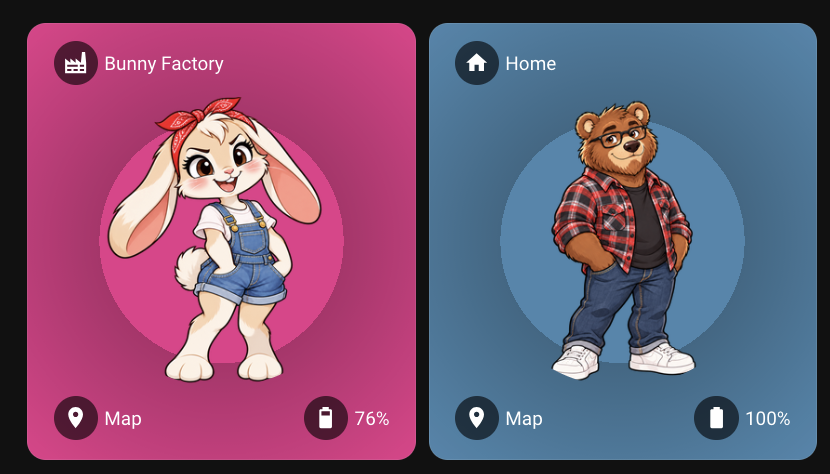
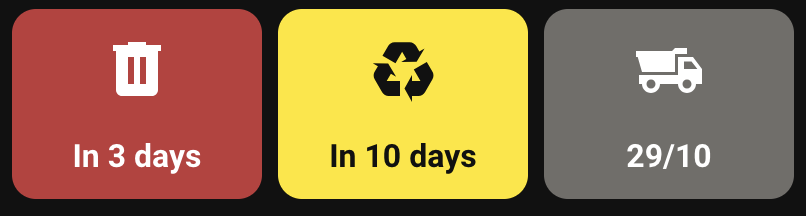

# Just a little repo to keep my Home Assistant yaml backed up

Anything in `/components` is in a state I'm not too embarrassed about. `/lab` is for work in progress and likely not worth using. `/chop-shop` is for the random snippets and crap that I'm too embarrassed to share&hellip; Hence why it's ignored in git and you can't see it.

## Components worth looking at

### Dynamic Person Card

`dynamic-person-card` switches avatar and colours based on person's zones.

[Full documentation](./components/dynamic-person-card/README.md)

### Bin Night Card

`bin-night-card` uses a user-defined Home Assistant calendar to show when each bin needs to go out
for collection and when to bring it in. Tapping a tile marks the bin as taken out.

[Full documentation](./components/bin-night-card/README.md)
